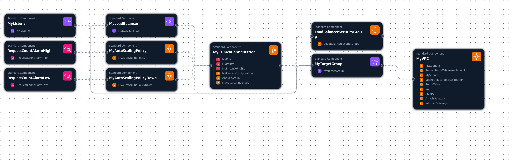
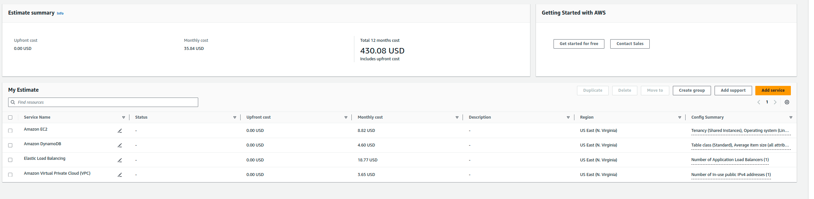
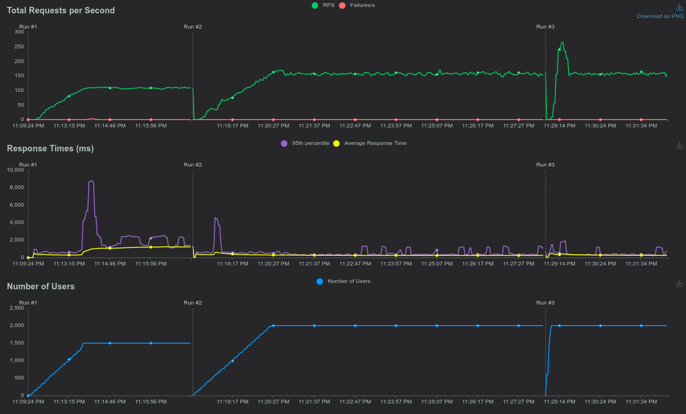

# Projeto Cloud 
### Ariel Tamezgui Leventhal

#### link repositório: https://github.com/arieltl/ProjetoCloudFormation
## Índice

 [Projeto Cloud](#projeto-cloud)
   - [Introdução](#introdução)
   - [A aplicação](#a-aplicação)
   - [Resumo Arquitetura](#resumo-arquitetura)
   - [Requisitos para execução](#requisitos-para-execução)
     - [Permissões necessárias no IAM](#permissões-necessárias-no-iam)
   - [Instruções de uso](#instruções-de-uso)
     - [Deploy através de script de conveniência](#deploy-através-de-script-de-conveniência)
     - [Deploy manual](#deploy-manual)
     - [Deletar Stack](#deletar-stack)
   - [Testando a aplicação](#testando-a-aplicação)
   - [Teste rápido de AutoScaling](#teste-rápido-de-autoscaling)
   - [Arquitetura](#arquitetura)
     - [Diagrama de arquitetura](#diagrama-de-arquitetura)
     - [VPC](#vpc)
     - [Subnets](#subnets)
     - [EC2](#ec2)
     - [AutoScaling](#autoscaling)
     - [Application Load Balancer](#application-load-balancer)
     - [Security Groups](#security-groups)
     - [DynamoDB](#dynamodb)
   - [Custo](#custo)
     - [Premissas](#premissas)
     - [Cálculo](#cálculo)
     - [Custo por teste de carga](#custo-por-teste-de-carga)
   - [Teste de Carga](#teste-de-carga)
     - [Executando o teste de carga](#executando-o-teste-de-carga)

## Introdução
Este é um projeto de deploy de uma aplicação em infraestrutura na AWS através de CloudFormation. 

## A aplicação
A aplicação é um software open source criado pela própria AWS como demonstração de uso do DynamoDB. É um jogo da velha multiplayer onde o login é feito apenas por nome (sem senha). Um jogador pode convidar outro jogador por nome para um jogo. Ao aceitar uma partida, o estado do jogo é sempre guardado no DynamoDB. O histórico de jogos de cada jogador é mantido em um banco de dados.

## Resumo Arquitetura
A aplicação é executada dentro de instâncias de EC2 com auto scaling baseado em número de requests por target. Os requests são distribuídos às instâncias através de um Application Load Balancer. O banco de dados utilizado é o DynamoDB. Ele está sem IP público, porém os EC2 conseguem acessá-lo devido a um role do IAM.

## Requisitos para execução
 - Necessário ter AWS CLI instalada e autenticada
 - Permissões necessárias no IAM
 - Necessário ter AWS CLI configurada com região padrão us-east-1 (execute `aws configure` e pressione Enter para manter as configurações anteriores, exceto a região padrão que deve ser alterada para us-east-1)
 - Para utilizar scripts de conveniência, é necessário usar sistema operacional Linux
### Permissões necessárias no IAM
- AdministratorAccess
- AmazonDynamoDBFullAccess
- AmazonEC2FullAccess
- AWSCloudFormationFullAccess
- ElasticLoadBalancingFullAccess
- IAMFullAccess

## Instruções de uso
### Deploy através de script de conveniência
1. Clone este repositório
		
		git clone https://github.com/arieltl/ProjetoCloudFormation
1. Entre no diretório do projeto

		cd ProjetoCloudFormation
1. Execute o script de conveniência deploy
    ```
	sudo chmod +x deploy.sh
	```
	```
    ./deploy.sh <stackname>
    ```
 4. Aguarde o deploy terminar, ao fim do deploy será exibido automaticamente o DNS do load balancer, use-o para acessar a aplicação.

	#### Configurando parâmetros de AutoScaling
	Use o script deploy passando os parâmetros desejados, exemplo:
	```bash
	./deploy.sh myStack "ParameterKey=HighThreshold,ParameterValue=1000 ParameterKey=LowThreshold,ParameterValue=3000"  
	```

	Os parâmetros HighThreshold e LowThreshold são os valores de requests por target que acionam os alarmes de auto scaling. O HighThreshold é o valor de requests por target que aciona o alarme de aumento de instâncias, o LowThreshold é o valor de requests por target que aciona o alarme de diminuição de instâncias. Importante notar que o HighThreshold é avaliado em um período diferente do LowThreshold, por isso o exemplo acima usa um número maior para o LowThreshold. Leia mais sobre isso na seção de [AutoScaling](#autoscaling).

### Deploy manual
1. Siga os passos 1 e 2 do tópico anterior
2. Execute o comando abaixo para criar a stack (omita os parâmetros caso deseje utilizar os valores padrão)
	```
	aws cloudformation create-stack \                                                      
	--stack-name <stackname> \
	--template-body file://projeto.yaml --capabilities CAPABILITY_IAM \
	--parameters ParameterKey=HighThreshold,ParameterValue=<value> ParameterKey=LowThreshold,ParameterValue=<value>
	```
3. Aguarde o deploy terminar, para ter certeza que o deploy foi bem-sucedido, verifique o AWS Console
4. Após o fim do deploy, execute o comando abaixo para obter o DNS do Load Balancer ou acesse o console da AWS e verifique o output da stack
	```
	 aws cloudformation describe-stacks --stack-name <stackname> --query "Stacks[0].Outputs" 
	```
### Deletar Stack
 - Para deletar a stack sem deletar a tabela do DynamoDB, execute o comando

		aws cloudformation delete-stack --stack-name <stackname>
 - Para deletar a stack e a tabela do DynamoDB, execute o script de conveniência destroy
	```
	 sudo chmod +x destroy.sh
	```
	```
	 ./destroy.sh <stackname>
	```

## Testando a aplicação
1. Acesse o DNS do Load Balancer exibido ao final do deploy
1. No canto superior direito, utilize o campo de texto para inserir o nome do jogador e clique em "Login"
1. Clique em "Create" para criar um novo jogo
1. Insira o nome do jogador que deseja convidar para jogar e clique em "Create Game"
1. Abra em outro navegador ou em uma aba anônima e faça login com o nome do jogador convidado, haverá um convite pendente listado
1. O convite estará armazenado no DynamoDB, ele será exibido por tempo ilimitado até que seja aceito ou recusado
1. Clique em "Accept" para aceitar o convite
1. Jogue e divirta-se!
1. Você pode sair e retornar ao jogo a qualquer momento, o estado do jogo será mantido no DynamoDB
1. Ao fim do jogo, retorne para a tela inicial, o jogo ficará salvo no histórico dos jogadores

## Teste rápido de AutoScaling
1. Execute o comando abaixo para gerar requests para o Load Balancer
	```
	./test.sh <dns-alb> <num_requests>
	```
1. Caso o número de requests seja omitido, o script irá gerar 20 requests, o que é suficiente para acionar o alarme caso os parâmetros padrão sejam utilizados

## Arquitetura
### Diagrama de arquitetura


### VPC
Foi criada uma VPC para o projeto utilizando o bloco de IP `10.0.0.0/16`. 

### Subnets
Foram criadas 2 subnets privadas em zonas de disponibilidade diferentes. As subnets foram criadas com os blocos de IP `10.0.0.0/24` e `10.0.1.0/24`. A necessidade de criar 2 subnets privadas é para garantir alta disponibilidade da aplicação e é uma exigência do Application Load Balancer.

### EC2
Foram criadas instâncias EC2 t2.micro com uma AMI customizada gerada a partir do Ubuntu. A AMI foi compartilhada com a organização e já conta com a aplicação instalada e configurada e uma unit file para iniciar a aplicação através do systemd. Foi utilizado o UserData para rodar um script Python inicial e, em seguida, iniciar o serviço da aplicação. A necessidade do script inicial é explicada na seção do [DynamoDB](#dynamodb).

### AutoScaling
Foi criado um AutoScaling Group para garantir alta disponibilidade da aplicação. O AutoScaling Group foi configurado para escalar o número de instâncias baseado no número de requests por target. O AutoScaling Group foi configurado para ter no mínimo 1 instância e no máximo 5 instâncias. Foram criados 2 alarmes CloudWatch que executam Scaling Policies para aumentar e diminuir o número de instâncias baseado no número de requests por target. O alarme de aumento de instâncias é acionado quando o número de requests por target é maior que o parâmetro de High em 1 dos últimos 6 pontos de dados, cada ponto de dado corresponde a requests por 10 segundos. O alarme de diminuição de instâncias é acionado quando o número de requests por target é menor que o parâmetro de Low em 1 dos últimos 2 pontos de dados, cada ponto de dado corresponde a requests por 60 segundos. Existe um cooldown de 65 segundos para evitar que o AutoScaling Group aumente e diminua o número de instâncias muito rapidamente.

Existe uma diferença entre o período avaliado para aumentar ou diminuir o número de instâncias, isso foi feito para que o auto scaling respondesse mais rapidamente a um aumento de requests do que a uma diminuição de requests. A métrica de Requests por Target é atualizada a cada 60 segundos, porém ela separa corretamente os datapoints de 10 segundos. Caso fosse feito um alarme de um datapoint de 60 segundos, para um número x de requests, o auto scaling só iria aumentar o número de instâncias após 60 segundos de requests acima de x, o auto scaling não responderia a um pico rápido de (x/6)+1 requests, já com um alarme de um datapoint em 6 de 10 segundos para x/6 requests, o mesmo pico causa o aumento de instâncias.

### Application Load Balancer
O Application Load Balancer ouve na porta 80 e distribui os requests entre as instâncias do AutoScaling Group na porta 5000.

### Security Groups
Foram criados Security Groups para as instâncias EC2 e para o Application Load Balancer. O Security Group das instâncias EC2 permite tráfego de entrada na porta 5000 apenas do Security Group do Application Load Balancer. O Security Group do Application Load Balancer permite tráfego de entrada na porta 80 de qualquer IP.

### DynamoDB
A tabela do DynamoDB é criada pela aplicação e não é criada pelo CloudFormation. Isso permite que o resto da infraestrutura seja destruída e recriada sem perder os dados da aplicação. A aplicação é em Python2 usando a biblioteca boto para acessar o DynamoDB. O boto não permite criação de tabelas On-Demand, apenas provisionadas. Para que fosse possível lidar melhor com picos de tráfego, foi criado um script em Python3 que cria a tabela caso ela não exista usando boto3, que permite tabelas On-Demand.

Para que a aplicação consiga acessar o DynamoDB, foi criado um role no IAM que permite acesso à tabela do DynamoDB. O role foi anexado às instâncias EC2.

## Custo

### Premissas
Considerando que a aplicação é um jogo da velha multiplayer, é esperado que o número de jogadores seja muito baixo na maior parte do tempo. Porém, situações atípicas como um dia chuvoso que é feriado ou um streamer popular jogando o jogo podem causar um pico de jogadores. Como seria difícil prever um bom valor para o tráfego normal, optei por ser pessimista considerando picos muito mais frequentes do que o normal, dessa maneira, caso seja possível lidar com o worst case scenario, o custo para o uso normal não deverá causar problemas orçamentários.

Foi considerado que serão jogados entre 2 a 4 mil jogos por dia. Sendo que esses jogos concentrados em um período pequeno de tempo de modo que a maior parte do dia apenas uma instância estará rodando e durante 30 minutos por dia, 3 instâncias estarão rodando. Cada jogo tem tamanho no DynamoDB de cerca de 0.5kb e cada load de página tem cerca de 4kb. Considerando os altos períodos de inatividade foi usado, em média, apenas 1 IP público e uma média de 10 requests por segundo ao load balancer (o que é uma média pessimista mesmo considerando o tempo de baixo tráfego). Foi considerado que o DynamoDB já tem 10GB de dados armazenados.

### Cálculo
Baseado nessas premissas, a calculadora de custo da AWS estima um custo de U$35.84 por mês.


### Custo por teste de carga
O custo no dia em que foi feito o [teste de carga](#teste-de-carga) foi de U$1.43, valor um pouco acima do calculado, porém a quantidade de requests feitas é equivalente a cerca de 8 a 10 mil jogos no dia, o que é acima do valor usado para os cálculos. Portanto, o custo do teste de carga foi considerado compatível com o calculado.
O custo do worst case scenario pode ser então estimado como cerca de U$40,00 por mês.

## Teste de Carga

Foi feito um teste com Locust de 5 minutos com 1500 usuários virtuais, cada usuário fazendo um request a cada 5 a 20 segundos. Logo em seguida, foi feito um teste de 10 minutos com 2000 usuários. Em seguida, esse teste foi estendido por mais cerca de 5 minutos para aguardar a estabilização do auto scaling.

Os valores dos parâmetros da stack foram escolhidos baseados em testes prévios para garantir que o auto scaling estabilizasse em 5 máquinas. Permitindo ver se o uso de CPU estava em uma faixa aceitável e, portanto, se 5 máquinas eram suficientes para o pico de tráfego.

O pico de uso de CPU antes da estabilização do auto scaling foi de cerca de 65%, o que é um valor aceitável. Após a estabilização, o uso de CPU nas 5 instâncias foi de 30 a 40%, o que é um valor muito bom. Isso indica que o auto scaling foi capaz de responder rapidamente ao aumento de tráfego e que o número de instâncias foi suficiente para lidar com o pico de tráfego, e mesmo não podendo escalar para 6 instâncias, essas 5 instâncias ainda poderiam lidar com mais tráfego.

Os principais picos de Response Time foram correspondentes a eventos de auto scaling.

### Executando o teste de carga
1. Crie um ambiente virtual Python
2. Instale as dependências
	```
	pip install -r requirements.txt
	```
3. Execute o Locust dentro do diretório deste repositório
	```
	locust
	```
4. Acesse o URL exibido no terminal e cole o DNS do Load Balancer.
5. Configure o número de usuários virtuais e o tempo desejado e inicie o teste.
